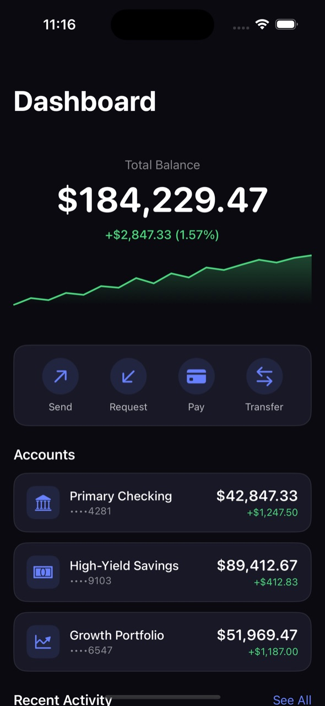
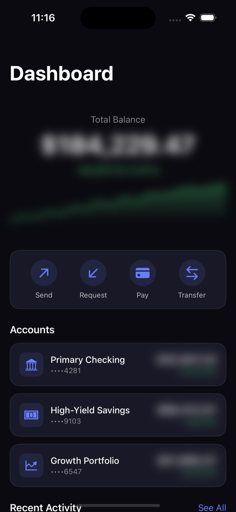
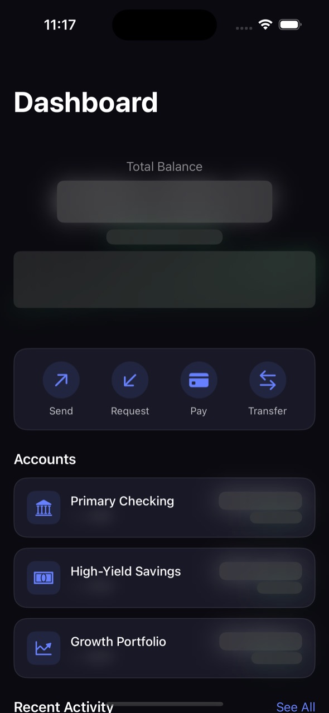
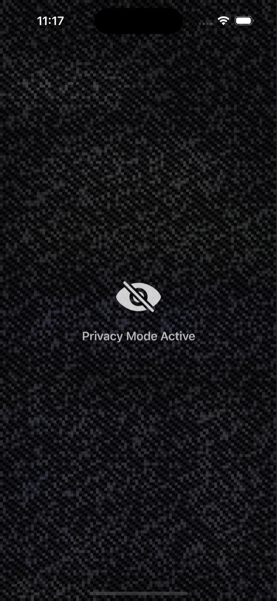

# PrivacyScreen

[](https://swift.org)
[](https://developer.apple.com/ios/)
[](https://swift.org/package-manager/)
[](LICENSE)

A Swift Package library that simulates hardware-level privacy screen protection using ARKit face tracking and CoreMotion sensor fusion. When someone looks over your shoulder, your sensitive content blurs. When a threat clears, it fades back.

https://github.com/user-attachments/assets/6d7dcc35-bb0e-4d51-8137-27a9f2f22932

---

## What It Does

Most privacy screen protectors are physical filters that dim your display. PrivacyScreen does it in software by watching for three threat signals in real time:

- **Second face** — ARKit detects someone else looking at your screen
- **Gaze deviation** — you look away, suggesting you're handing the device over or distracted
- **Device tilt** — the phone tilts past a natural holding angle, or rotates suddenly (snatch detection)

These signals are fused into a `ThreatLevel` that drives progressive content blurring without ever blocking the UI.

---

## Expected Behavior

### Threat levels

```
.clear      Normal use. All content visible.

.cautious   Slight shoulder-surfing risk.
            High-sensitivity content blurs (balances, card numbers, CVV).

.threatened Elevated risk — gaze drifted, tilt detected.
            Medium-sensitivity content also blurs (names, dates).

.locked     Instant lock — second face detected, or rapid tilt (snatch).
            Full-screen privacy shield activates. Low-sensitivity
            content (merchant names) hidden too.
```

### Progressive blur — what you see

```
Normal view                  .cautious                    .locked
┌─────────────────────┐      ┌─────────────────────┐      ┌─────────────────────┐
│ Total Balance       │      │ Total Balance       │      │░░░░░░░░░░░░░░░░░░░░░│
│                     │      │                     │      │░░░░░░░░░░░░░░░░░░░░░│
│   $184,229.47       │  →   │   ███████████       │  →   │░░░░░░░░░░░░░░░░░░░░░│
│   +$2,847.33        │      │   ████████          │      │░░░  Privacy Mode ░░░│
│   ▁▃▅▆▇▇▇▇▇▇▇▇▇     │      │   █████████████     │      │░░░    Active     ░░░│
│                     │      │                     │      │░░░░░░░░░░░░░░░░░░░░░│
│ Primary Checking    │      │ Primary Checking    │      │░░░░░░░░░░░░░░░░░░░░░│
│ ....4281            │      │ ....4281            │      │░░░░░░░░░░░░░░░░░░░░░│
│ $42,847  +$1,247    │      │ ██████████  ██████  │      │░░░░░░░░░░░░░░░░░░░░░│
└─────────────────────┘      └─────────────────────┘      └─────────────────────┘
  Touch passes through          Touch passes through          Touch passes through
```

The overlay always uses `.allowsHitTesting(false)` — the UI remains fully interactive under the blur.

<p align="center">
  
  
  
  
</p>

<p align="center">
  <code>.clear</code> &nbsp;&rarr;&nbsp; <code>.cautious</code> &nbsp;&rarr;&nbsp; <code>.threatened</code> &nbsp;&rarr;&nbsp; <code>.locked</code>
</p>

### Sensitivity mapping

| Content | Sensitivity | Blurs at |
|---------|------------|----------|
| Account balances, card numbers, CVV | `.high` | `.cautious` |
| Names, account numbers, dates | `.medium` | `.threatened` |
| Merchant names | `.low` | `.locked` |

### Power states

PrivacyScreen adapts its power draw based on how actively the device is being used:

```
  pickup
────────▶ ACTIVE (180mW)   accel 30Hz, ARKit continuous 60fps
              │
   still 8s   │
              ▼
          IDLE (30mW)      accel 15Hz, ARKit 0.5s bursts every 3s (~17% duty)
              │
  still 30s   │
              ▼
        DORMANT (5mW)      accel 5Hz, ARKit off (wake-on-motion)

  threat ≥ .threatened (from any state)
────────▶  ALERT (180mW)   same as ACTIVE; exits after threat clears + 5s cooldown
                           ──▶ ACTIVE
```

Idle mode saves ~83% power vs always-on by duty-cycling ARKit at 17%.

---

## Library Integration

### Swift Package Manager

```swift
// Package.swift
.package(path: "../PrivacyScreen")  // local

// or from a remote URL:
.package(url: "https://github.com/abhay/PrivacyScreen", from: "0.1.0")
```

### Setup

```swift
import PrivacyScreen
import SwiftUI

@main
struct MyApp: App {
    @StateObject private var privacyManager = PrivacyManager()
    @StateObject private var powerThrottler = PowerThrottler()

    var body: some Scene {
        WindowGroup {
            ContentView()
                .environmentObject(privacyManager)
                .environmentObject(powerThrottler)
                .onAppear {
                    // PowerThrottler owns the CMMotionManager — pass externalMotion: true
                    privacyManager.startMonitoring(externalMotion: true)
                    powerThrottler.attach(to: privacyManager, arSession: privacyManager.arSession)
                    powerThrottler.start()
                }
        }
    }
}
```

> **Important:** iOS enforces a single `CMMotionManager` per app. `PowerThrottler` owns it and forwards data via `processMotionFromThrottler(_:)`. Never create a second instance.

### Mark sensitive content

```swift
// Balances, card numbers, CVV — blur at .cautious
Text(formatCurrency(account.balance))
    .privacySensitive(level: .high)

// Names, dates — blur at .threatened
Text(account.holderName)
    .privacySensitive(level: .medium)

// Merchant names — blur at .locked only
Text(transaction.merchant)
    .privacySensitive(level: .low)
```

### Add the shield overlay

```swift
ZStack {
    MyContentView()
    PrivacyShieldOverlay()  // full-screen lock at .locked
}
```

### Optional: debug overlay

```swift
if privacyManager.showDebugOverlay {
    PrivacyDebugOverlay()  // live sensor readouts
    PowerDebugView()       // power state machine
}
```

### Threat level colors

`ThreatLevel` exposes a `color: Color` property for building your own indicators:

```swift
Circle()
    .fill(privacyManager.threatLevel.color)
// .clear → .green, .cautious → .yellow, .threatened → .orange, .locked → .red
```

---

## VaultDemo

A Mercury/Revolut-inspired finance app (all data hardcoded) that shows PrivacyScreen on realistic UI.

### Screens

| Tab | Content | Sensitive fields |
|-----|---------|-----------------|
| **Dashboard** | Total balance, sparkline chart, account list, recent transactions | Balance, daily change, account numbers |
| **Accounts** | Per-account balance cards with daily P&L | Balances, full account numbers |
| **Activity** | Transaction history with merchant, category, date | Amounts, dates, merchant names |
| **Cards** | Full card face with number, expiry, CVV | Card number, CVV, cardholder name, expiry |
| **Settings** | Privacy toggles, tilt/gaze sensitivity sliders, "Simulate Threat" button | — |

### Cards

Each card carries a `CardTheme` that controls its gradient:

- **`.blue`** — blue-to-violet gradient (Visa credit card)
- **`.slate`** — dark charcoal gradient (Mastercard debit)

### Simulator testing

ARKit face tracking requires a physical device with a TrueDepth camera (iPhone X or later). On simulator:

- Face tracking is disabled; tilt detection still works
- Use **Settings → Simulate Threat** to force `.locked` state for 3 seconds and see the full overlay

### Demo mode

Launch with `-demo` to run a scripted walkthrough of all threat levels with captions — useful for recording videos:

```bash
xcrun simctl launch booted com.vaultdemo.app -demo
```

Launch with `-screenshots` for the same sequence without captions (clean screenshots).

---

## Architecture

```
ARKit face anchors ──┐
                     ├──→ ThreatState (pure scoring, fully testable)
CMMotionManager ─────┘         │
(owned by PowerThrottler)      ↓
                         PrivacyManager (@MainActor, publishes threatLevel)
                               │
                    ┌──────────┴──────────┐
                    ↓                     ↓
         PrivacySensitiveModifier   PrivacyShieldOverlay
         (blur per sensitivity)     (full lock at .locked)
```

### Scoring

```
secondFaceDetected          → instant .locked
deviceTiltRate > 120°/s     → instant .locked (snatch)

primaryFaceLost             → +2
gazeDeviation > 0.5 rad     → +2
gazeDeviation > 0.3 rad     → +1
abs(tiltAngle) > 40°        → +2
abs(tiltAngle) > 25°        → +1

score 0 → .clear
score 1 → .cautious
score 2 → .threatened
score 3+ → .locked
```

Escalation is immediate (1–2 frames). De-escalation requires all 8 frames in the smoothing window to be below the current level (~133ms hysteresis).

---

## Requirements

- iOS 17+
- Xcode 16+
- TrueDepth camera for ARKit face tracking (iPhone X or later); falls back to accelerometer-only on older devices and simulator

## Development

```bash
# Build the library
swift build --sdk "$(xcrun --sdk iphonesimulator --show-sdk-path)" \
  -Xswiftc "-target" -Xswiftc "arm64-apple-ios17.0-simulator"

# Run tests (29 ThreatState unit tests)
xcodebuild test -scheme PrivacyScreen \
  -destination 'platform=iOS Simulator,name=iPhone 16' -quiet

# Build VaultDemo
xcodebuild build -project Example/VaultDemo/VaultDemo.xcodeproj \
  -scheme VaultDemo -destination 'platform=iOS Simulator,name=iPhone 16' -quiet

# Lint and format
swiftlint lint Sources/ Tests/ Example/
swiftformat --lint Sources/ Tests/ Example/

# Auto-fix
swiftformat Sources/ Tests/ Example/
swiftlint lint --fix Sources/ Tests/ Example/
```

Pre-commit hooks (SwiftFormat + SwiftLint) and pre-push hooks (tests) run automatically via lefthook.
